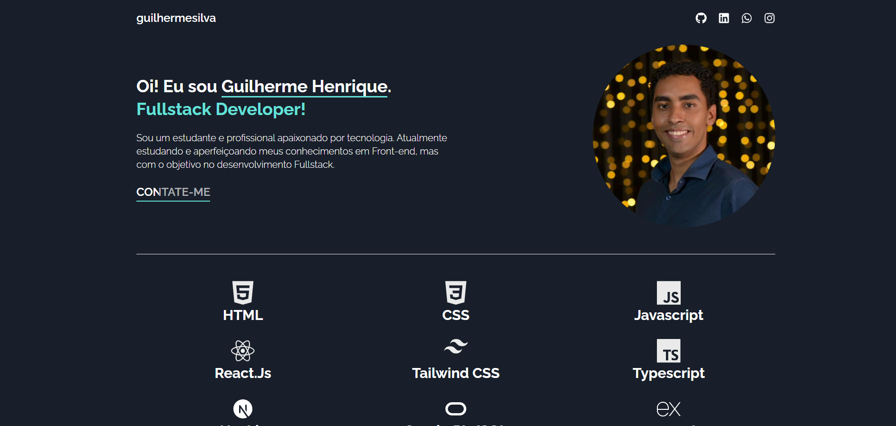

# MEU PORTFOLIO


> Meu portifólio pessoal criado do zero usando React

<div style="width:100%; display:flex; align-items:center; gap:16px">


</div>

## Detalhes do aplicativo

- Nesse projeto fiz a criação do meu portfólio responsável por demonstrar meus principais desenvolvimentos, sendo eles desktop ou mobile.
Para esse feito, criei o projeto usando React + Vite.


## 🚀 Melhorias implementadas
- [x] - Estilização com Tailwind CSS
- [x] - Biblioteca de icones Feather Icons
- [x] - Projeto criado com auxilio do Vite


## 💻 Como usar o projeto
Para gerar uma cópia do projeto e implementar as suas melhorias, esteja em um computador com Node Js instalado e siga as etapas abaixo:

1  clone o projeto com o comando 
```
git clone https://github.com/devggui/portfolio
``` 
2  Acesse o projeto pelo terminal com o comando 
```
cd portfolio
```  
3  Instale as dependências necessárias com o comando
```
npm install
```
4  Rode o projeto com o comando
```
npm run dev
``` 
5  Ou acesse o aplicativo através do website []() 


## 🌐 Links úteis
[NodeJS](https://nodejs.org/en/download)  
[NextJS](https://nextjs.org)  
[Tailwind CSS](https://tailwindcss.com)  
[Feather Icons](https://feathericons.com)
[Vite](https://vitejs.dev)


## 🧑‍💻 Guilherme Henrique

[](https://www.linkedin.com/in/devggui)
[](https://gthub.com/devggui)
[](http://wa.me/5514998619263)
[](https://devggui.netlify.app)